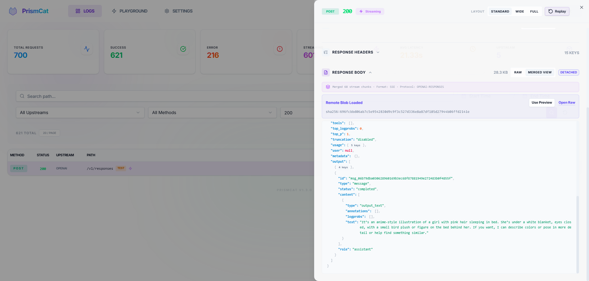
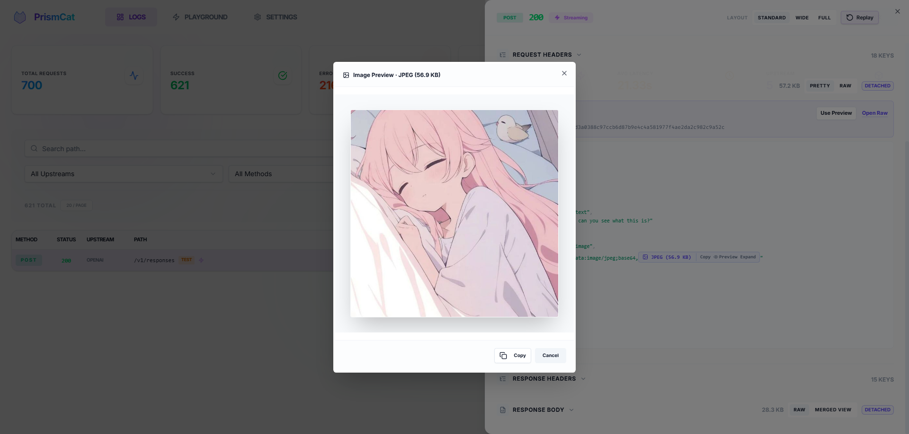

# 🐱 PrismCat

[English](./README.md) | [简体中文](./README_CN.md)

  

> **你永远不知道 SDK 在你的 Prompt 里偷偷塞了多少东西 —— 直到你用了 PrismCat。**

PrismCat 是一个**自托管的 LLM API 透明代理与调试控制台**。
只需改一行 `base_url`，即可完整记录你的应用与 OpenAI / Claude / Gemini / Ollama 等任意 LLM API 之间的所有通信 —— 包括流式响应 (SSE)。

<!-- 📸 PrismCat Dashboard -->



---

## ⚡ 30 秒上手

### 1. 启动

前往 [Releases](https://github.com/paopaoandlingyia/PrismCat/releases) 下载对应系统的压缩包。

| 平台 | 启动方式 |
|------|---------|
| **Windows** | 双击 `prismcat.exe`，自动隐藏至系统托盘 |
| **Linux / macOS** | 终端执行 `./prismcat` |
| **Docker** | 参见 [Docker 部署](#-docker-部署) |

打开浏览器访问 **`http://localhost:8080`** 进入控制面板。

### 2. 添加上游

在 Settings 页面添加一个上游，例如：

| 名称 | 目标地址 |
|------|---------|
| `openai` | `https://api.openai.com` |

PrismCat 会自动生成一个代理地址：**`http://openai.localhost:8080`**

### 3. 改一行代码，开始抓包

```python
from openai import OpenAI

client = OpenAI(
    base_url="http://openai.localhost:8080/v1",  # ← 只改这里
    api_key="sk-..."
)

# 其余代码和平时完全一样
response = client.chat.completions.create(
    model="gpt-4o",
    messages=[{"role": "user", "content": "Hello!"}],
)
```

回到控制面板，你已经能看到完整的请求和响应了。就这么简单。

---

## 🧩 它是怎么工作的？

PrismCat 使用**子域名路由**实现透明代理。当你在 Settings 里添加一个名为 `openai` 的上游后：

```
你的应用                     PrismCat                      OpenAI
   │                           │                             │
   │  openai.localhost:8080    │   api.openai.com            │
   │ ─────────────────────────>│ ────────────────────────────>│
   │                           │          记录请求 ✓          │
   │<─────────────────────────│<────────────────────────────│
   │                           │          记录响应 ✓          │
```

**为什么用子域名？** 因为它是真正的"透明代理"——你的请求路径（如 `/v1/chat/completions`）完全不需要改动。无论你用哪种 SDK、哪种语言，只要它支持自定义 `base_url`，直接把域名指向 PrismCat 就行了。甚至可以串联多级代理（App → PrismCat → 中转站 → OpenAI），每一环都无感接入。

> **💡 关于 `*.localhost`**：现代浏览器和大多数操作系统都会将 `*.localhost` 自动解析为 `127.0.0.1`，无需配置 hosts 文件。如果你的环境不支持，可以参考 [备选：路径路由模式](#-备选路径路由模式) 或手动添加 hosts 条目。

---

## ✨ 核心特性

### 📊 完整的流量观测
- 记录完整的请求头、请求体、响应头、响应体
- **SSE 流式响应**完整捕获，支持查看原始流或合并后的完整文本
- JSON 自动格式化美化，大段 Base64（如内嵌图片）智能折叠并支持一键预览，告别刷屏




### 🎮 一键重放 (Playground)
看到一条失败的请求？点击 **Replay**，在浏览器里直接修改 Prompt、参数，一键重发，秒级定位问题。不用重新跑你的 Python/Node 脚本。

### 🔐 隐私与安全
- **纯本地部署**，数据存在本地 SQLite + 文件系统，不经过任何第三方服务器
- 自动对 `Authorization`、`api-key` 等敏感头部脱敏

### 🏷️ 日志标签
请求时加一个 Header `X-PrismCat-Tag: my-tag`，即可在 UI 里按标签筛选。多人 / 多项目共用一个代理时特别有用。

### 📦 极简部署
单个二进制文件，没有任何外部依赖。Windows 支持系统托盘静默运行，Docker 原生支持。

### 🔄 常驻运行，随时复盘
PrismCat 设计为 **7×24 小时静默运行的 LLM 黑匣子**。你不需要“出了 bug 才想起来开抓包”——它一直在那里默默记录。自动清理过期日志、大 body 分离存储防止数据库膨胀，让你可以随时回溯几天前某个 Agent 到底发了什么请求、模型到底回了什么内容。特别适合监控那些你觉得“无法掌控”的自主 Agent。

---

## 🎯 谁需要 PrismCat？

| 你遇到的问题 | PrismCat 怎么帮你 |
|-------------|------------------|
| "为什么 Token 消耗这么大？我的 Prompt 明明很短啊" | 看到 SDK / 框架偷偷注入的 system prompt 和 few-shot 示例 |
| "Function Calling 返回的 JSON 总是格式错误" | 抓到模型返回的原始文本，在 Playground 里改 Prompt 重试 |
| "流式输出有时候会卡住或截断" | 完整记录每一个 SSE chunk，精确定位是模型、网关还是客户端的问题 |
| "我用 Ollama 跑本地模型，想看看实际通信" | 添加一个上游指向 `http://localhost:11434`，完全通用 |
| "多人共用一个 API Key，谁的请求出了问题？" | 用 `X-PrismCat-Tag` 按用户打标签，一目了然 |
| "Agent 跑着跑着就失控了，不知道它中间干了什么" | PrismCat 常驻记录每一次 API 调用，随时回溯 Agent 的完整行为链路 |

---

## 🤔 和其他工具有什么不同？

| | PrismCat | mitmproxy | Langfuse / Helicone |
|---|---------|-----------|---------------------|
| 部署方式 | 单二进制 / Docker | 本地安装 + 证书配置 | SaaS 或自建复杂后端 |
| 针对 LLM 优化 | ✅ JSON 美化、Base64 折叠、SSE 合并 | ❌ 通用 HTTP 抓包 | ✅ 但偏向生产监控 |
| 一键重放 | ✅ 内置 Playground | ❌ | 部分支持 |
| 接入方式 | 改 `base_url` | 全局代理 / 证书 | 侵入 SDK 代码 |
| 数据归属 | 完全本地 | 完全本地 | 依赖外部服务 |
| 流式响应回看 | ✅ 原始流 + 合并视图 | 体验差 | 部分支持 |
| 长期运行 | ✅ 自动清理、静默常驻 | 临时调试工具 | ✅ 但依赖外部基础设施 |

---

## 🐳 Docker 部署

```yaml
services:
  prismcat:
    image: ghcr.io/paopaoandlingyia/prismcat:latest
    container_name: prismcat
    ports:
      - "8080:8080"
    environment:
      # 控制面板访问地址白名单
      - PRISMCAT_UI_HOSTS=localhost,127.0.0.1
      # 代理基础域名（子域名路由依赖此配置）
      - PRISMCAT_PROXY_DOMAINS=localhost
      # 公网部署时请务必设置密码
      - PRISMCAT_UI_PASSWORD=your_strong_password
      - PRISMCAT_RETENTION_DAYS=30
    volumes:
      - ./data:/app/data
    restart: always
```

---

## 🔀 备选：路径路由模式

如果你的环境无法正确解析 `*.localhost`（少数 Windows 网络配置或容器内场景），可以在 Settings 中开启 **路径路由模式**，通过路径前缀代替子域名：

```python
# 路径路由模式 —— 无需子域名解析
client = OpenAI(
    base_url="http://localhost:8080/_proxy/openai/v1",
    api_key="sk-..."
)
```

也可以通过配置文件或环境变量开启：

```yaml
# config.yaml
server:
  enable_path_routing: true
  path_routing_prefix: "/_proxy"
```

```bash
# 或通过环境变量
PRISMCAT_ENABLE_PATH_ROUTING=true
```

> **注意**：路径路由模式下，请求路径会被添加前缀（如 `/_proxy/openai/...`），某些 SDK 的路径拼接逻辑可能需要额外注意。子域名模式不存在这个问题。

---

## 🌐 生产部署 (Nginx + 泛域名)

公网部署推荐使用泛域名解析（如 `*.prismcat.example.com`）配合 Nginx：

```nginx
server {
    listen 80;
    server_name prismcat.example.com *.prismcat.example.com;

    location / {
        proxy_pass http://127.0.0.1:8080;
        proxy_set_header Host $host;  # 必须：透传 Host 用于子域名路由

        # SSE / 流式响应必须配置
        proxy_http_version 1.1;
        proxy_set_header Connection "";
        proxy_buffering off;

        client_max_body_size 50M;
    }
}
```

然后在 PrismCat 的 `proxy_domains` 中添加 `prismcat.example.com`，上游 `openai` 即可通过 `openai.prismcat.example.com` 访问。

---

## ⚙️ 配置参考

配置文件位于 `data/config.yaml`，首次启动自动创建。大多数选项可通过 UI 的 Settings 页面修改。

<details>
<summary>完整配置示例</summary>

```yaml
server:
  port: 8080
  ui_password: ""           # 控制面板密码
  proxy_domains:            # 子域名路由的基础域名
    - localhost

logging:
  max_request_body: 1048576       # 请求体记录上限 (1MB)
  max_response_body: 10485760     # 响应体记录上限 (10MB)
  sensitive_headers:              # 自动脱敏的 Header
    - Authorization
    - api-key
    - x-api-key
  detach_body_over_bytes: 262144  # 超过 256KB 的数据分离存储
  early_request_body_snapshot: true

storage:
  retention_days: 30              # 日志保留天数，0 = 永久

upstreams:
  openai:
    target: "https://api.openai.com"
    timeout: 120
  gemini:
    target: "https://generativelanguage.googleapis.com"
    timeout: 120
```

</details>

---

## 🧩 常见问题

<details>
<summary><b>Q: <code>openai.localhost</code> 无法访问？</b></summary>

大多数现代系统会自动将 `*.localhost` 解析为 `127.0.0.1`。如果不行：
1. 手动在 hosts 文件中添加 `127.0.0.1 openai.localhost`
2. 或者开启 [路径路由模式](#-备选路径路由模式) 作为替代
3. 或者使用自己的泛域名（参见 [Nginx 部署](#-生产部署-nginx--泛域名)）
</details>

<details>
<summary><b>Q: Streaming 感觉卡住了？</b></summary>

如果你在反向代理（如 Nginx）后面使用 PrismCat，务必确认：
- `proxy_buffering off;`
- `proxy_http_version 1.1;`

Nginx 默认会缓冲整个响应再转发，这会导致流式输出看起来像是"卡住"了。
</details>

<details>
<summary><b>Q: 支持哪些 LLM 服务？</b></summary>

PrismCat 是通用 HTTP 代理，与具体的 LLM 服务无关。只要是走 HTTP/HTTPS 的 API 都能用，包括但不限于：
- OpenAI / Azure OpenAI
- Anthropic Claude
- Google Gemini
- Ollama / LM Studio（本地模型）
- 各类中转站 / API 聚合服务
</details>

<details>
<summary><b>Q: 会影响请求速度吗？</b></summary>

PrismCat 使用异步日志写入，代理本身的延迟通常在 1ms 以内。日志记录不会阻塞请求的转发和响应。
</details>

---

## 🛡️ License

[MIT License](LICENSE)
